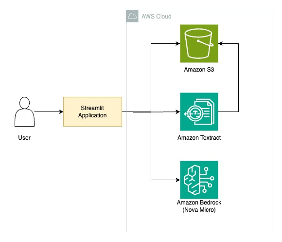

# textract-bedrock-document-insights

## Low Latency Document Analysis with AWS

A sample Streamlit application for analyzing documents using AWS Textract and Bedrock - Amazon Nova Micro Model. Users can upload documents (images or PDFs) and get quick insights.

## Architecture




## Features

- Document upload (supports PNG, JPG, JPEG, PDF)
- Text extraction using AWS Textract
- Document analysis using AWS Bedrock (Nova Micro model)
- Custom prompts for tailored analysis
- Execution Time Tracking

## Installation

1. Clone the repository:
   ```
   git clone https://github.com/aws-samples/textract-bedrock-document-insights.git
   cd textract-bedrock-document-insights
   ```

2. Install the required dependencies:
   ```
   pip install -r requirements.txt
   ```

## Configuration

Set the following environment variables:

- `S3_BUCKET`: The name of your S3 bucket for document storage
- `AWS_REGION`: The AWS region to use (defaults to "us-east-1" if not set)

You can set these variables in your environment or optionally use a `.env` file as below:

1. Create a `.env` file in the root directory of the project:
   ```bash
   touch .env

2. Add the above environment variables to the .env file
3. The application will automatically load these variables using python-dotenv. 

Note: Make sure to add .env to your .gitignore file to keep these details secure.

## Usage

Run the Streamlit application:

```
streamlit run src/main.py
```

Then, open your web browser and navigate to the URL provided by Streamlit.

## Dependencies

- boto3
- streamlit
- python-dotenv

Make sure you have the necessary AWS credentials configured to access S3, Textract, and Bedrock services, along with model access to Amazon Nova Micro.

## Optional: Running with Virtual Environment

If you prefer to run this project in a Python virtual environment, follow these steps:

1. Create a virtual environment in your project directory:
   ```bash
   python -m venv venv
   ```

2. Activate the virtual environment:
   - On macOS/Linux:
     ```bash
     source venv/bin/activate
     ```
   - On Windows:
     ```bash
     venv\Scripts\activate
     ```

3. Install the required packages:
   ```bash
   pip install -r requirements.txt
   ```

4. Run the application:
   ```bash
   streamlit run src/main.py
   ```

5. When you're done, you can deactivate the virtual environment:
   ```bash
   deactivate
   ```

Note: You'll need to activate the virtual environment each time you want to run the project.
